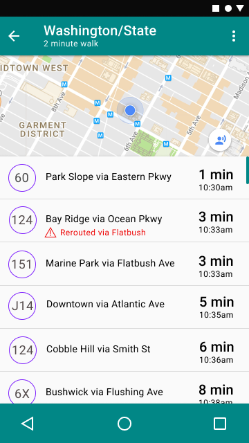

# busy-bus

BusyBus is an alternative transit app that enhances the experience of the bus commuter by providing a clean and easy interface for all things related to bus commuting.

The particular screen that was coded was a case study for one particularly busy stop, and reflects my solution for displaying the various pieces of information necessary.

My design process included:
1. User Surveys
2. Competitive Analysis
3. User Personas
4. User Stories
5. User Flows
6. Sketching
7. Wireframing
8. Usability Testing
9. High Fidelity Mockups
10. Development of one main screen in HTML/CSS/JS

Below, you can see a screenshot of the page that I designed and rendered:

Please see link to my full presentation:

https://drive.google.com/file/d/1jlPamyahJKvlqtf-SHXvcx_XJzX7E01p/view?usp=sharing

